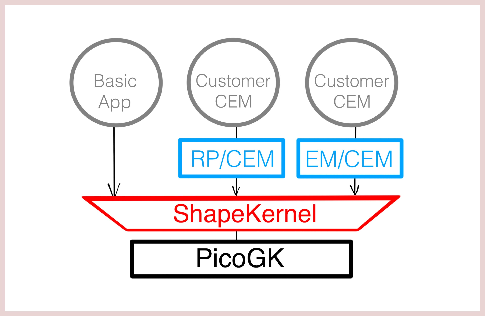

# Welcome to ShapeKernel

*(1) All parts from LEAP 71 were created through Computational Engineering Models based on the ShapeKernel library and the PicoGK engine.*

The LEAP 71 ShapeKernel library bridges the low-level operations of a geometry kernel (in our case PicoGK) and the high-level functions that you want to use, when creating sophisticated engineering objects. It aims to simplify the process of generating geometric primitives that serve as the "atoms" of much more complex designs. For instance, a single heat exchanger part would consist of hundreds of such simple shapes  (called **BaseShapes**) that are logically and spatially combined by Boolean() and Offset() operations. 

*(1) Examples of different BaseShapes.*

The ShapeKernel library is the foundation of the third layer of our software stack, which is the application-specific engineering layer. This layer holds algorithms that encode engineering knowledge and processes for certain kinds of objects, the actual **Computational Engineering Models** (CEMs). 

*(1) Software stack for Computational Engineering.*

Before diving into the details of what BaseShapes exist and how implicits and lattices can be rendered into voxels, let's get started with setting up the library and running an example task:

- [Tutorial 1: Getting Started](Documentation/README-GettingStarted.md)
- [The ShapeKernel — how does it work?](Documentation/README-ReadingDetails.md)
